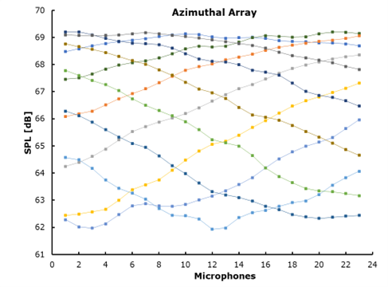

### METHODOLOGY
The objective of the investigation is to predict aeroacoustics data based on the dataset that was given. The data supplied was used as training data for the models, and predictions were made accordingly. The models’ parameters were tuned to minimize the error of prediction, while making the model generalized. Generalisation in machine learning happens when a model effectively predicts data from unseen diverse sources, in other words, when a model effectively learns the trends in the dataset without being constrained or overfitted by the parameters given. The complete methodology is illustrated below.


Model Training and Model Evaluation are an iterative process since they are repeated in order to minimize MAE and to match the training and test R2 scores. Model Optimisation is explained in the following section, as it is part of the Experimental Design. It could be implied that the models are optimised once they perform accurate predictions on the test data. Then, the validation data can be used in the model to verify the model’s ability to generalize well on unseen data. In cases where the model does not make good predictions on the validation data, then the model training and optimizing parameters have to be redefined.

[Legendre et al.](https://www.researchgate.net/publication/353771519_A_machine_learning-based_methodology_for_computational_aeroacoustics_predictions_of_multi-propeller_drones) followed a similar procedure for predicting aeroacoustics in drone applications. Nonetheless, more models and a different optimisation approach were used. Since the dataset used in this study is 10-fold smaller, a more accurate optimisation approach could be used as opposed to restricted only to randomized grid search.

The [G2TRC](https://www.nottingham.ac.uk/research/groups/gas-turbine-and-transmissions-centre/contact.aspx) provided the data used in this study. Two adjacent propellers from the NASA X-57 Maxwell were simulated using Ansys Fluent. The experiments were run under the following conditions: 12 ms-1 flow speed, 6500 rpm propellers, 9 mm diameter propellers, and 4 mm axial tip distance. In each experiment the phase angle between the propellers varied. A dataset was collected for phase angles between 0 to 165º, varying each 15º. 23 microphones were placed along an arc, ranging from 45º to 155º as shown in the figure below.


Figure: Polar array experimental design, from Silent-Prop.

The array was placed 165 mm away from the top of the blades. Two different configurations were explored. The polar array consisted in placing the arc perpendicular to the axis of rotation of the blade. In the azimuthal array the arc of the microphones was rotated 90 degrees. This means that the arc would be placed along the plane of rotation of the propellers, having microphone number 12 just in the middle of the propellers. These microphones took the readings of SPL in each simulation. The datapoints for polar array and azimuthal array are displayed in the figure below. 

  

 

Figure: Polar array (top) and Azimuthal array (bottom) sound pressure level distribution by phase angle.

### Data Pre-processing
This process involved manipulating the dataset to ensure that the models can identify the trends within the features. Different techniques were used to optimize the dataset for each model in order to maximize the prediction power of the models. A crucial step in data pre-processing is feature selection, in other words, selecting the features that will be used for training. Moreover, it should be noted that the features that are inputted in the model for training must match the features that will be used when generating predictions. If microphone number and phase angle are the features used in model training, then both features should be given when predicting an SPL value. The features available were narrowed down into microphone number and phase angle. Microphone number was firstly scaled to degrees, between 45º and 155º, as shown in the figure below.
Due to the nature of the dataset, the most defining decision was the choice of the scaler. Different normalisation techniques to scale the data may affect model performance. In regression, features X are usually normalised with a scaler and labels Y are normalised with a different scaler. This step usually increases the performance of the model. Data pre-processing also involves splitting the data between training data and test data. Usually, training and test is split between 80% and 20% accordingly. But, through testing, it was found out that leaving out one full phase angle data set performed better. For test data, microphones 1-23 at 135º were used, and the rest of the data was used for training.

### Model Training
Training a model involves fitting the data into a model. Both input data and real values of SPL are fed into the model. Consequently, the model tries many different combinations of its internal parameters to minimize the error between the predicted output and the real output. Each model has a different loss function that is defined from the coefficients and parameters of the model itself, and this is the function needed to be optimized. In simple terms, for a combination of parameters and coefficients (\theta), the loss function is defined as:

```math
L(θ) = \sum_{i=1}^N  (y_{pred} - y_{true})^{2} 
```


The error minimises as the model identifies the trends in the input data.

### Model Evaluation
Evaluation metrics are the method to assess how good is the accuracy of the model when predicting. There are several valid ways of assessing a regression model. One common metric for regression problems is mean absolute error. This is defined as follows:

```math
MAE =  \frac{1}{N}  \sum_{i=1}^N \mid y_{pred} - y_{true} \mid 
```

Mean absolute error takes a sum of the absolute difference between the predicted value and the actual value for each point, and then takes the mean of it. There is not a specific number of how good the MAE might be, since it is specific to the problem. However, MAE has proved to be very useful when comparing models. This means that a model with a lower MAE makes better predictions as it has a smaller error. [Legendre et al.](https://www.researchgate.net/publication/353771519_A_machine_learning-based_methodology_for_computational_aeroacoustics_predictions_of_multi-propeller_drones) used machine learning in aid with CFD to explore aero-acoustic production from drone systems and used MAE as the main evaluation metric. This in turn influenced the decision to select MAE as the primary evaluator for testing the model performance.

Additionally, the correlation of determination R2 can be used to measure the training and test accuracy, as well as to predict whether a model is overfitting. An R2 score on the training data means that the model is perfectly fitting the data []. An overfitting model would result in a very high R2 score for training data, and a significantly lower R2 for testing, while an optimized model would result in training and testing R2 scores very close to each other []. Besides being very difficult to achieve in very complex models, an ideal machine learning model would have equal train and test R2 score.

### Model Validation
Once a model has satisfied the requirements set in model evaluation, it can be applied for prediction generation. The [G2TRC](https://www.nottingham.ac.uk/research/groups/gas-turbine-and-transmissions-centre/contact.aspx) supplied the data used for validation, which consisted of polar and azimuthal array SPL values for blade phase angle at 22.5º and 82.5º. Those SPL values were gathered using the same high-fidelity software as before. The models that have been optimized were used to predict the aeroacoustics generation. Similarly, as in model evaluation, the evaluation metrics of these predictions will be produced to analyse how generalisable the model is.


### Results
After model optimisation was completed, each model was tested on unseen data. This data was inputted into each model to test the performance of each model. The figure below displays the predictions of noise generated in a polar array of two propellers with a phase angle of 22.5º and 82.5º. 


Figure: Polar array predictions for blade phase angle of 22.5º (top) and 82.5º (bottom) 

The three models were compared against the real data in both cases. The chosen phase angle of 22.5º is close to the boundaries of the trained data used by the model. While GPR and GBR do not produce very accurate trendlines, SVM severely underperforms. Even though the SVM is able to represent the trend accurately, it had failed to capture the magnitude of the prediction. On the other hand, GPR effectively captures the prediction of the model for initial microphone points, but increasingly loses accuracy and deviates from real data after microphone 10. The GBR model effectively captures the trend of the data, and represents the magnitude of the data, but does not produce a smooth line.
Similarly, predictions were made for the azimuthal array, indicated below.


Figure: Azimuthal array predictions for blade phase angle of 22.5º (top) and 82.5º (bottom)

Conveniently, the SVM captured the trend well on the low blade phase angle but failed to capture the magnitude well. Both GPR and GBR models captured the trend as well but failed on adjusting the magnitude of the SPL. Additionally, the GBR prediction at Microphone 1 deviates for almost 0.50 dB. The GBR has notably been proven to be the worse model for predicting the array of the azimuthal array at 22.5º.
Predicting sound at 82.5º in the azimuthal array gives the worst results. Even though the GBR captures the trend, it has been shifted 5 microphones to the right. The GPR model severely underperforms as it fails to capture the magnitude of the SPL output, by almost 1.0 dB. Analogously to the polar array, the SVM is the best model for capturing both trend and magnitude of the prediction at 82.5º. The SVM has, however, overpredicted the SPL value for microphones 7-11. As seen above, the azimuthal array is much noisier compared to the polar array, and this led to an overall worse performance for every model.